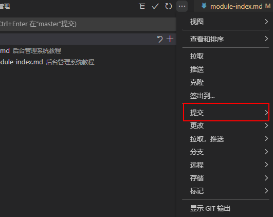

# git 工作流教程

- 采用的分支管理模式，可以把项目的开发分为四个阶段：开发、测试、预发布和发布

## 分支管理模式

### 开发阶段

- 1、 除了 master 分支创建一个供所有开发人员开发的 dev 分支；
- 2、开发人员在 dev 分支上进行工作，随时随地 commit，每天 push 一次到服务器；
- 3、push 代码前需要进行 pull 操作，因为有可能在之前有别的成员先进行了 push 操作，如果有冲突还需要进行冲突解决；
- 4、每天上班后所有成员对 dev 进行 pull 操作，获取所有成员 push 的代码，有冲突需要解决；
- 5、团队 Leader 每天将 dev 合并一次到 master。

### 测试阶段

- 1、测试进入后就需要添加 test 分支；
- 2、在开发人员将代码 push 到 dev 分支后，可以在 dev 基础上创建 test 分支，测试人员以 test 分支搭建测试环境，开始测试；
- 3、开发人员在接受到 bug 后，直接在测试分支上修改，然后让测试人员进行验证；
- 4、每天团队 Leader 将测试分支上修改的 bug 合并到 dev 分支上，这样所有团队成员当天修复的 bug 都会在第二天被团队其他人 pull 下来；
- 5、团队 Leader 每天将 dev 合并一次到 master。

### 预发布和发布阶段

- 1、系统上线后试运行阶段会存在两种改动：bug 和优化需求，bug 通常当天解决晚上部署，优化需求通常周末部署；
- 2、bug 当天能修复的就直接在 test 分支上修复，然后进行测试，验证通过后合并到 master；
- 3、bug 当天不能修复的就针对该 bug 创建一个分支，修复完后合并到 test 分支进行测试，验证通过后合并到 master；
- 4、每个优化需求都以 master 分支为基础创建一个 feature 分支，完成后合并到 dev 分支，开发人员可以先交叉测试，然后将 dev 合并到 test 进行测试，验证通过后合并到 master；
- 5、master 始终是一个干净的，可发布的分支。

### Merge Request 模式

- 代码拉取
  - 方式一（推荐）：小乌龟直接拉取
  - 方式二：vscode 进行 git clone

* 代码提交
  - 1、切换本地分支至 dev
  - 2、提交代码
  - 3、推送代码至 git 上的 dev
  - 4、推送代码至 git 上的 dev
